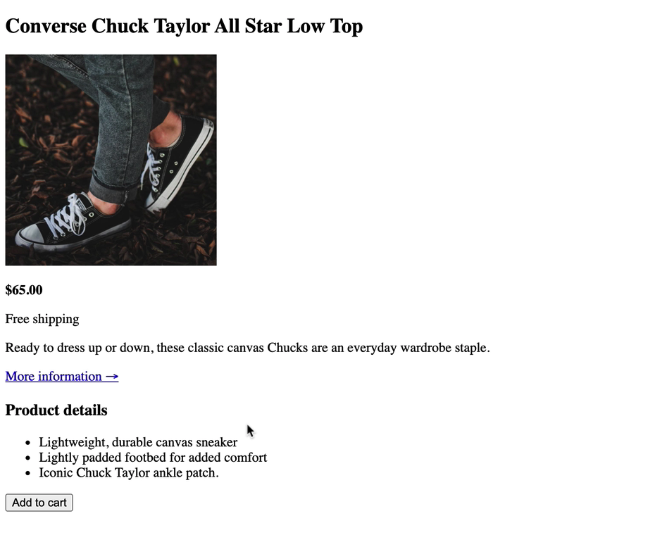

# This is challenge #1.

## Learn about HTML tags and CSS properties

The goal with this HTML and CSS challenges is to try to use different HTML tags and style it with CSS properties try to build this small website for Converse All Star shoe.

## Task to solve
Here is an overview of how the website should look. Remember that you don't have to match exactly the same color and font-size but try your best.

## Files overview 
This repository includes following files:

* index.html - This file is the first HTML file you create as you’re building a website. HTML ( HyperText Markup Language) can be seen as block elements that helps to structure your website. The index.html page is the default page a website visitor sees if no other page is specified.

* css - (Cascading Style Sheet) is an folder in the root directory which typically contains the style.css file.

* style.css - This file contains all styling and is used to describe the presentation of a document written in HTML. CSS describes how HTML elements should be rendered on screen, on paper, in speech, or on other media.

* img - ( an abbreviation for image) is an folder in the root directory which typically contains all images that will be applied on a website.

## You can find a list with HTML Tags ordered alphabetically on [W3schools](https://www.w3schools.com/tags/tag_html.asp).

## You can find a list with CSS properties ordered alphabetically on [W3schools](https://www.w3schools.com/cssref/index.php)

